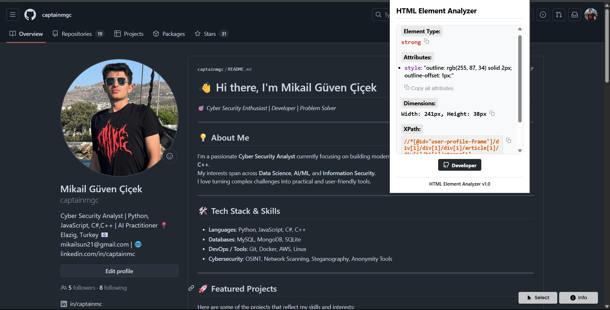
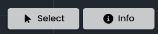
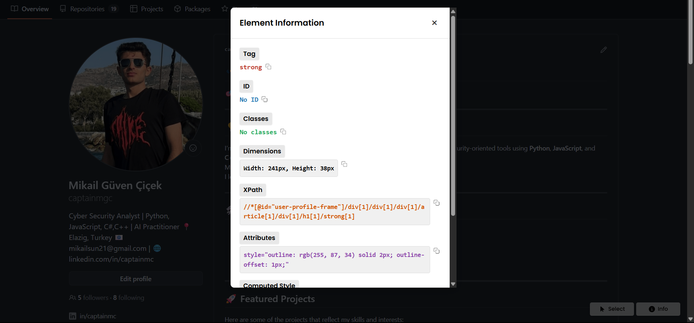
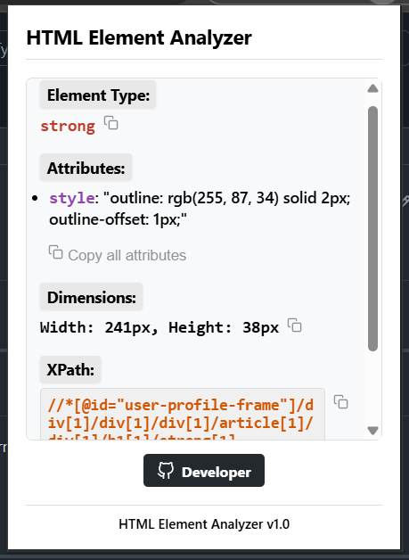

# HTML Element Analyzer

  
   
   
  
<strong>HTML elementleri hakkında detaylı bilgi edinmenizi sağlayan Chrome uzantısı</strong>

## 📸 Ekran Görüntüleri / Screenshots

  
  
<em>Element seçme ve vurgulama</em>

   
  
  
  
<em>Element bilgileri paneli</em>

   
  
  
  
<em>Detaylı bilgi modal paneli</em>

   
  
  
  
<em>Bilgileri kopyalama özellikleri</em>

## 🇹🇷 Türkçe

### Açıklama
HTML Element Analyzer, web sayfalarındaki HTML elementleri hakkında ayrıntılı bilgi almanıza yardımcı olan bir Chrome uzantısıdır. Bu uzantı sayesinde herhangi bir HTML elementinin özelliklerini, boyutlarını, CSS sınıflarını, ID'lerini ve XPath bilgilerini kolayca görüntüleyebilir ve kopyalayabilirsiniz.

### Özellikler
- Sayfanın sağ alt köşesinde bulunan "Select" butonu ile element seçimi
- Fare ile üzerine geldiğiniz elementlerin turuncu renkle vurgulanması
- Seçilen elementin detaylı bilgilerinin görüntülenmesi:
  - Element tipi (div, p, span vb.)
  - ID değeri
  - CSS sınıfları
  - Diğer özellikler (href, src vb.)
  - Boyutlar (genişlik ve yükseklik)
  - XPath
- Her bir bilgi öğesini ayrı ayrı veya tümünü birden kopyalama özelliği
- Bilgilere erişmek için popup panel veya modal panel seçenekleri

### Kurulum

#### Geliştirici Modunda Kurulum
1. Bu GitHub deposunu bilgisayarınıza indirin veya klonlayın.
2. Chrome tarayıcınızı açın ve adres çubuğuna `chrome://extensions` yazın.
3. Sağ üstteki "Geliştirici modu" seçeneğini etkinleştirin.
4. "Paketlenmemiş öğe yükle" butonuna tıklayın.
5. İndirdiğiniz proje klasörünü seçin ve "Klasör Seç" butonuna tıklayın.
6. Uzantı artık Chrome'unuza yüklenmiş olacaktır.

### Kullanım
1. Uzantıyı yükledikten sonra herhangi bir web sayfasını açın.
2. Sayfanın sağ alt köşesinde görünen "Select" butonuna tıklayın.
3. İncelemek istediğiniz HTML elementinin üzerine gelin (turuncu renkle vurgulanacaktır) ve tıklayın.
4. Element bilgileri görüntülenecektir.
5. Her bir bilgiyi kopyalamak için yanındaki kopyalama ikonuna tıklayın.
6. Tüm bilgileri kopyalamak için "Copy All Information" butonuna tıklayın.
7. Detaylı bilgi modalını açmak için "Info" butonuna tıklayın.

---

## 🇬🇧 English

### Description
HTML Element Analyzer is a Chrome extension that helps you get detailed information about HTML elements on web pages. With this extension, you can easily view and copy properties, dimensions, CSS classes, IDs, and XPath information of any HTML element.

### Features
- Element selection using the "Select" button in the bottom right corner of the page
- Highlighting elements in orange when hovering over them
- Displaying detailed information about the selected element:
  - Element type (div, p, span, etc.)
  - ID value
  - CSS classes
  - Other attributes (href, src, etc.)
  - Dimensions (width and height)
  - XPath
- Ability to copy each piece of information separately or all at once
- Access information via popup panel or modal panel options

### Installation

#### Installation in Developer Mode
1. Download or clone this GitHub repository to your computer.
2. Open Chrome browser and enter `chrome://extensions` in the address bar.
3. Enable "Developer mode" option in the top right corner.
4. Click on "Load unpacked" button.
5. Select the project folder you downloaded and click "Select Folder".
6. The extension will now be installed in your Chrome.

### Usage
1. After installing the extension, open any webpage.
2. Click on the "Select" button that appears in the bottom right corner of the page.
3. Hover over the HTML element you want to inspect (it will be highlighted in orange) and click on it.
4. The element information will be displayed.
5. Click on copy icons next to each piece of information to copy individual items.
6. Click on "Copy All Information" to copy all data to clipboard.
7. Click on "Info" button to open detailed information modal.

## 🤝 Katkıda Bulunma / Contributing

Katkılarınızı bekliyoruz! Bir hata bulursanız veya bir özellik önerisi yapmak isterseniz, lütfen bir issue açın veya pull request gönderin.

We welcome contributions! If you find a bug or want to suggest a feature, please open an issue or submit a pull request.

## 📄 Lisans / License

Bu proje MIT Lisansı altında lisanslanmıştır. Detaylı bilgi için [LICENSE](LICENSE) dosyasına bakın.

This project is licensed under the MIT License. See the [LICENSE](LICENSE) file for more information. 